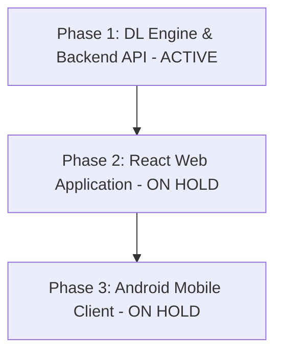

# VisionGuard AI — Advanced Research Implementation Plan (Phased)

We are upgrading the **VisionGuard** project using a phased approach. We will first build and validate the core deep learning architecture and backend API. The frontend web app and Android app are on hold until Phase 1 is complete.

---

## Project Phases

* **Phase 1 (ACTIVE):** Build the Attention-Gated Multi-Task models, create the Google Colab training notebook for knowledge distillation, set up the FastAPI server, and verify input/output pipelines.
* **Phase 2 (ON HOLD):** Build the premium React web frontend.
* **Phase 3 (ON HOLD):** Build the cloud-connected Android mobile client.

---

## Phase 1 Active Scope & Proposed Changes

We will create and organize the following components under the `backend/` and `notebooks/` directories in the workspace:

### 1. Deep Learning Models (PyTorch)

We will implement a multi-task network that outputs both a binary classification (glaucoma probability) and segmentation maps (optic cup/disc masks). This enables the calculation of the **Cup-to-Disc Ratio (CDR)**.

#### [NEW] [attention_blocks.py](file:///c:/Users/ijlal/Desktop/GLUCOMA%20DETECTOR/backend/attention_blocks.py)
Implements the **Convolutional Block Attention Module (CBAM)**:
* **Channel Attention:** Focuses on *what* features are important (e.g., color changes, neuroretinal rim thinning).
* **Spatial Attention:** Focuses on *where* the features are located (e.g., locking onto the center of the optic nerve).

#### [NEW] [models.py](file:///c:/Users/ijlal/Desktop/GLUCOMA%20DETECTOR/backend/models.py)
Defines our two PyTorch models:
1. **Teacher Model (ResNet-50 + CBAM + Decoder):**
   * Multi-task outputs: Classification Head (Glaucoma probability) and Segmentation Decoder (Optic disc and cup masks).
2. **Student Model (EfficientNet-B0 + Light CBAM + Decoder):**
   * A lighter version of the model, optimized for fast CPU inference.

#### [NEW] [distillation_pipeline.py](file:///c:/Users/ijlal/Desktop/GLUCOMA%20DETECTOR/notebooks/distillation_pipeline.py)
A complete PyTorch training script designed to run on Google Colab:
* Data loading and augmentation for **REFUGE** (with segmentation masks) and cross-dataset testing on **ACRIMA** and **RIM-ONE**.
* Joint loss optimization: $Loss_{total} = Loss_{classification} + \lambda Loss_{segmentation}$.
* Distillation loss: Transfers logit values (KL Divergence) and spatial attention map shapes (MSE loss) from Teacher to Student.
* Saves the final weights to `model/teacher_model.pth` and `model/student_model.pth`.

---

### 2. FastAPI API Backend

#### [NEW] [main.py](file:///c:/Users/ijlal/Desktop/GLUCOMA%20DETECTOR/backend/main.py)
* Configures FastAPI routing.
* **`POST /api/screen`**: Receives an uploaded fundus image, processes it, runs inference, and returns:
  * Diagnostic prediction (Normal vs. Glaucoma) and model confidence.
  * Extracted Cup-to-Disc Ratio (CDR) value.
  * Base64-encoded Grad-CAM Heatmap overlay.
  * Base64-encoded segmentation boundaries (optic cup in blue, optic disc in green).
* **`GET /api/metrics`**: Returns comparison tables showing accuracy, recall, and specificity of the Teacher vs. Student models on REFUGE, ACRIMA, and RIM-ONE DL.

#### [NEW] [backend/requirements.txt](file:///c:/Users/ijlal/Desktop/GLUCOMA%20DETECTOR/backend/requirements.txt)
Defines python packages needed for the backend: `fastapi`, `uvicorn`, `torch`, `torchvision`, `pillow`, `numpy`, `opencv-python-headless`, `pytorch-grad-cam`.

---

### 3. Pipeline Validation

#### [NEW] [test_pipeline.py](file:///c:/Users/ijlal/Desktop/GLUCOMA%20DETECTOR/backend/test_pipeline.py)
A lightweight verification script to test input/output shapes of the models, the CBAM blocks, and mock inference through the backend before training.

---

## Verification Plan

### Automated Verification
* Run `python backend/test_pipeline.py` locally to verify that:
  1. Input shape `(1, 3, 224, 224)` successfully outputs classification shape `(1, 2)` and segmentation shape `(1, 2, 224, 224)`.
  2. The CBAM modules correctly forward features.
  3. The FastAPI app mounts and runs mock screening requests successfully.
